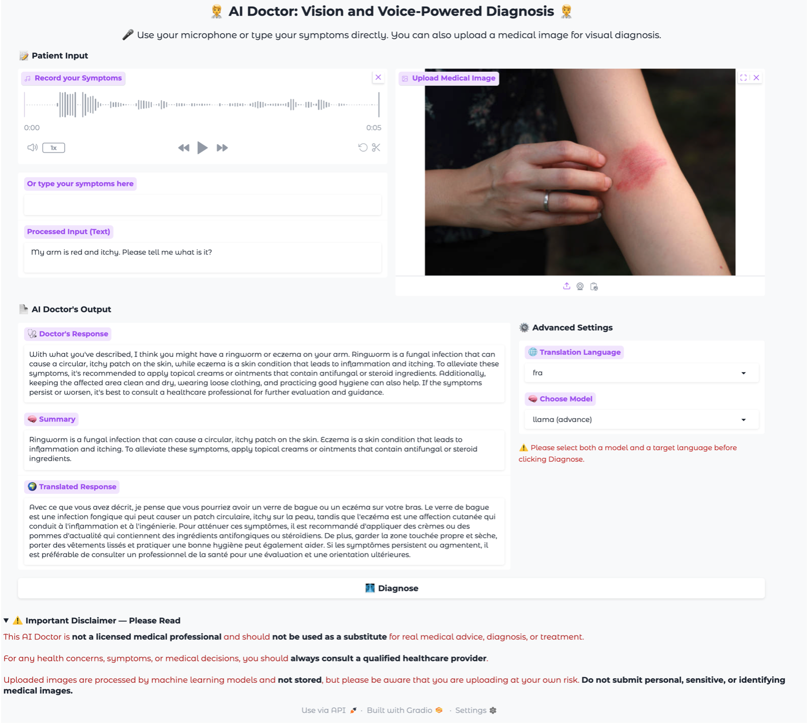
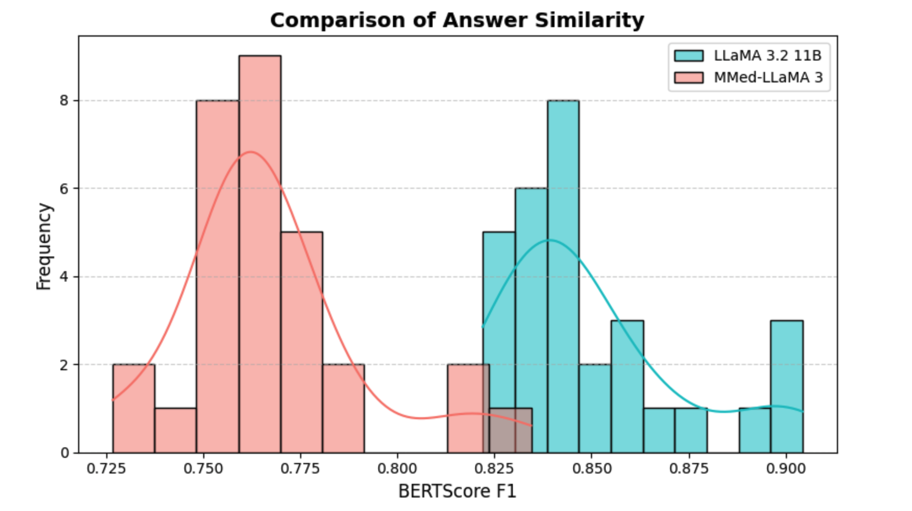

# 🩺 AI Doctor: Real-Time Medical Assistance with Multimodal Large Language Model

## 🧠 Overview

This project introduces a real-time **AI Doctor** chatbot powered by a **Multimodal Large Language Model (LLM)**. It supports both **voice** and **text** input, understands **medical images**, and provides responses via **speech** and **text**. Additional features include summarization and translation — offering a natural and accessible healthcare assistant.

---

## 🌟 Features

- 🔍 **Multimodal LLM**  
  Handles both text and image inputs for medical understanding  
  _↪️ Implemented in `brain_of_the_doctor.py`_

- 🗣️ **Speech-to-Text (STT)**  
  Converts patient voice input into text using Whisper  
  _↪️ Implemented in `voice_of_the_patient.py`_

- 🔈 **Text-to-Speech (TTS)**  
  Generates spoken responses from AI-generated answers  
  _↪️ Implemented in `voice_of_the_doctor.py`_

- 💬 **Interactive Gradio UI**  
  Provides a simple, real-time interface for user interaction  
  _↪️ Implemented in `gradio_app.py`_
---

## 🧪 Our Contributions

### 1. 🧑‍⚕️ AI Doctor Application
A conversational AI that helps users make informed decisions about seeking medical care — potentially reducing unnecessary visits and improving access.
  
<p align="center">
  
</p>

---

### 2. 🗂️ Custom Dataset Creation

Most existing medical datasets lack paired image-text data and focus on modalities like CT or PET scans — not suitable for real-world symptom images. To address this:

- We built a medical VQA dataset using **user-uploaded images** and **GPT-4o-generated** Q&A pairs simulating real patient inquiries and expert-level answers.
🤗 Dataset available on [Hugging Face](https://huggingface.co/datasets/SiyunHE/medical-pilagemma-lora)
📂 Data creation details: See [`data_creation/`](data_creation)

---

### 3. 🔧 Fine-tuning with LoRA

We fine-tuned **PaliGemma** using **LoRA** on our dataset to build a lightweight alternative to **LLaMA 3.2 11B Vision-Instruct**.

- Applied LoRA to cross-attention layers for efficient adaptation
- Trained with Hugging Face Trainer on **Google Colab A100**
- Learning rate: `5e-5`, Batch size: `4`, Epochs: `3`
- Outperforms base PaliGemma on medical VQA, with a smaller footprint

🤗 [Fine-tuned model on Hugging Face](https://huggingface.co/SiyunHE/medical-pilagemma-lora)  
📁 Fine-tuning details: See [`experiments/`](experiments)

---

### 4. 📊 Model Evaluation

We evaluated model performance using **BERTScore F1** on 30 samples from our dataset, comparing:

- 🔬 **LLaMA-3.2-11B-Vision-Instruct** (model we used)
- 🧬 **MMed-LLaMA 3** (trained on medical data)

<p align="center">
  
</p>

📈 Results: Our model consistently achieves higher semantic alignment with ground truth answers, indicating stronger response quality for real-world medical VQA tasks.

📁 evaluation details: See [`evaluation/`](evaluation)

---

## ⚙️ Setup Instructions

### 🛠️ Prerequisites

- 🐍 **Python 3.11+**

- 🔑 **Environment Variables:**
 👉 See `.env.example` for required environment variables.

  - `GROQ_API_KEY` — _(Free)_  
    Required for **speech-to-text (STT)** using `whisper-large-v3`.

  - `HF_TOKEN` — _(Free)_  
    Needed to load the **Google PaliGemma** model: `google/paligemma-3b-pt-224`.

  - `OPENROUTER_API_KEY` — _(Paid or Free)_  
    Used to access **meta-llama/llama-3.2-11b-vision-instruct**  
    > We currently use the **paid version** for more stable performance,  
    > but you may switch to the free version:  
    > `meta-llama/llama-3.2-11b-vision-instruct:free`

### 🛠️Setup steps

1. Clone this repository:
   ```bash
   git clone medical_chatbot_project_genAI
   cd medical_chatbot_project_genAI
   ```
2. create a new environment with conda (recommend)
   ```bash
   conda create --name ai_doctor python=3.11
   ```
   create a new environment without conde
   ```bash
   python3 -m venv venv
   source venv/bin/activate   # On macOS/Linux
   .\venv\Scripts\activate     # On Windows
   ```
3. activate the enviornment
   ```bash
   conda activate ai_doctor
   ```
4. Install dependencies:
   ```bash
   pip install -r requirements.txt
   ```
5. start the application
   ```bash
   gradio gradio_app.py
   ```


### 🚀 Future Development

- Add real-time medical knowledge via **Retrieval-Augmented Generation (RAG)** to overcome LLM knowledge cutoffs.
- Use **Medical Communication Protocols (MCP)** for better scalability and healthcare system integration.
- Expand **language support** and enhance **medical reasoning** capabilities.
- Conduct **clinical validation** to assess safety and real-world effectiveness.


## 📚Reference:
https://github.com/AIwithhassan/ai-doctor-2.0-voice-and-vision <br>
https://github.com/RyanWangZf/MedCLIP
